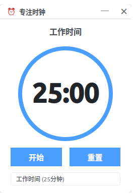

# 专注时钟

一个简洁的番茄工作法计时器应用，帮助你提高工作效率。

> 声明：本人不会编程，该程序完全由 cursor 生成（包括README文件）。

## 开发环境
- 操作系统：Ubuntu 24.04
- 开发框架：Qt 6.7.2
- 开发工具：CLion + Cursor AI

## 主要功能

### 基础功能
- 支持 25 分钟工作时间
- 支持 5 分钟短休息
- 支持 15 分钟长休息
- 可随时暂停和继续计时
- 一键重置计时器

### 界面特性
- 无边框窗口设计
- 圆形进度条显示剩余时间
- 支持窗口拖动
- 简洁现代的界面风格
- 支持最小化和关闭操作

### 悬浮窗功能
- 最小化主窗口时显示悬浮窗
- 悬浮窗可自由拖动位置
- 支持锁定/解锁悬浮窗位置
- 双击悬浮窗可恢复主窗口

### 系统托盘
- 支持最小化到系统托盘
- 托盘图标右键菜单
- 托盘提示显示当前状态和剩余时间
- 支持通过托盘菜单控制程序

## 使用说明

1. 选择工作模式：
   - 工作时间（25分钟）
   - 短休息（5分钟）
   - 长休息（15分钟）

2. 控制按钮：
   - 开始/暂停：控制计时器
   - 重置：重置当前计时

3. 悬浮窗操作：
   - 拖动：可自由移动悬浮窗位置
   - 锁定：鼠标悬停时显示锁定按钮
   - 双击：显示主窗口

4. 系统托盘：
   - 左键单击：显示主窗口
   - 右键菜单：
     - 显示主窗口
     - 显示/隐藏悬浮窗
     - 退出程序

## 界面预览

- 主窗口：显示圆形进度条和控制按钮
- 悬浮窗：紧凑显示剩余时间
- 系统托盘：显示程序状态和快捷操作

## 技术特性

- 使用 Qt 6 开发
- 自定义无边框窗口
- 自定义圆形进度条控件
- 支持窗口阴影效果
- 平滑的动画过渡效果 